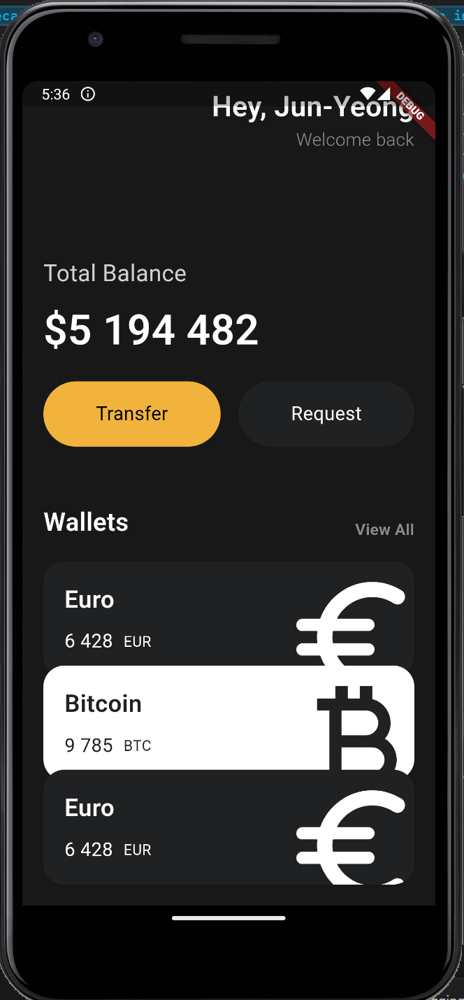

# Flutter로 모바일 앱 화면 구현 Study

### 혼자서 공부하는 Flutter 공부
  - 노마드 코더 참고

| No. | 제목 | 내용 | 화면 구성 |
|---|---|---|---|
| 1 | Wallet App | - Wallet 형태의 앱 화면 구현   - App 화면에서 구현되는 아이콘 구현    | [Click! if you move to My_Wallet_App Repo](https://github.com/JYPJUN/flutter_Study/tree/master/my_wallet_app)     |
