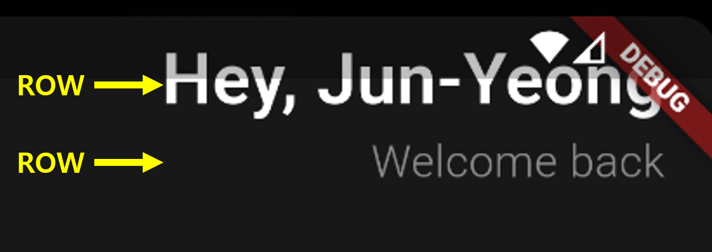
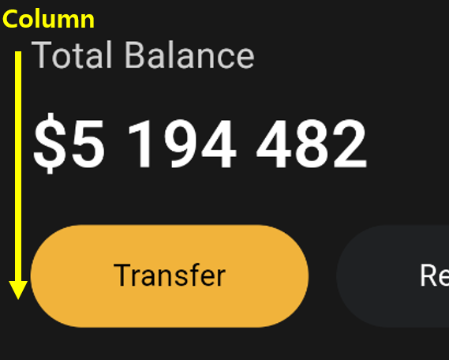
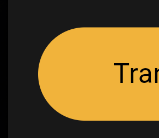
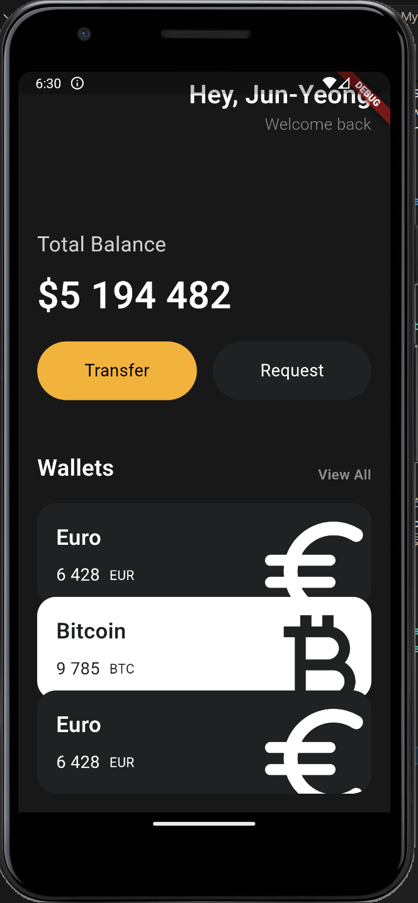

# My Wallet App

- 코드 분석 내용 작성

## 1. App class

- class App은 StatelessWidget 형태를 상속 받음
- StatelessWidget은 상태가 변하지 않는 위젯을 정의할 때 사용됨
- State를 가지지 않고 단순히 UI를 그리기만 하는 Widget

```Dart
  class App extends StatelessWidget 
```

- build 함수는 Flutter Widget의 필수 함수로 UI를 그리는 역할이며, 이 함수는 Widget이 rendering 될 때마다 호출됨
- MaterialApp은 Flutter에서 제공하는 기본 앱 구조
  - ※ 테마, 라우트, 네이게이션 설정 가능
  - ※ MaterialApp은 iOS와 Android 가이드 디자인, CupertinoApp은 iOS 가이드 디자인

```Dart
  Widget build(BuildContext context) {
    return MaterialApp
    ...
  }
```

---

## 2. Main Code in App

### 1. Row 와 Column
- Row : 자식 Widget들을 가로로 배치하는 Widget
- Column : 자식 Widget들을 세로로 배치하는 Widget
- 정렬 속성
  - CrossAxisAlignment : 반대 축(교차 축) 방향으로 자식 위젯을 정렬
  - MainAxisALignment : 주 축 방향으로 자식 위젯을 정렬




```Dart
  Row(
    mainAxisAlignment: MainAxisAlignment.end,
    children: [
      Column(
        crossAxisAlignment: CrossAxisAlignment.end,
      ...
```

### 2. SizedBox
- 고정된 크기의 빈 공간을 생성하는 Widget
- LayOut에서 특정 간격을 만들 때 유용

```Dart
  const SizedBox(height: 50)
```

### 3. Text

- Flutter에서 텍스트를 화면에 표시하는 데 사용하며 다양한 스타일과 형식을 지원
- TextStyle Class 안에 fontSize, fontWeight, color 구성
- Colors의 withOpacity는 float 데이터 타입 형태를 넣어야 하며, 적용 시 글자가 옅어짐 (0.5 -> 50프로 적용)
- 특수 문자를 일반 문자로 사용 시 \\(백슬래시) 사용

```Dart
const Text("\$5 194 482",
                    style: TextStyle(
                      fontSize: 40,
                      fontWeight: FontWeight.w600,
                      color: Colors.white.withOpacity(0.5),
                    )),
```

### 4. SingleChildScrollView

- 스크롤 가능한 영역을 만들어주는 Widget, 자식 Widget이 홤녀을 넘어갈 경우 스크롤 기능을 추가하여 스크롤할 수 있게 해줌

```Dart
  @override
  Widget build(BuildContext context) {
    return MaterialApp(
      home: Scaffold(
        backgroundColor: const Color(0xFF181818),
        body: SingleChildScrollView(
          ...
```

### 5. Container

- Box LayOut을 만들 때 사용하며, 다양한 스타일과 변환을 적용할 수 있음
- decoration : BoxDecoration을 사용하여 컨테이너의 스타일을 지정
- borderRadius : 모서리를 둥글게 만듦   
     

```Dart
  Container(
      decoration: BoxDecoration(
        borderRadius: BorderRadius.circular(45),
        color: bgColor,
      ),
```

### 6. 완성된 App 디자인
- 코드는 main.dart 파일 참고
  - component : button.dart, currency_card.dart
  
  -    